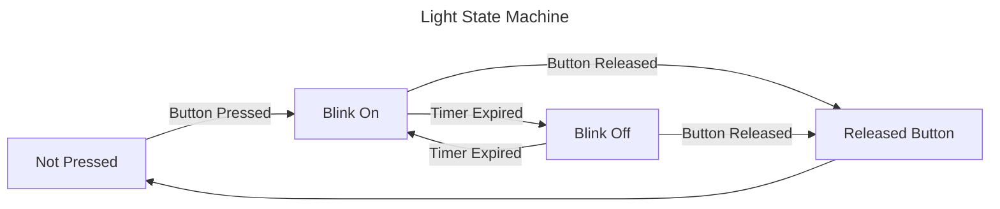

# State Machines

## What is a state machine

- **Time** series sequence of operations
- **Other work** happens between steps
- **Waiting for** something else to finish before proceeding

## Requirements

- **Some value** that keeps track of current position in operation
- **Transition Logic** to move from one logical state to another
- **Other values** relevant to the current state

# Example

## Blinking light

Requirements: 
1. When button is not pressed light will be off.
2. When button is pressed, light will blink.
3. Light will turn on immediately when button is pressed.
4. Light will continue to flash until button is released.
5. When button is released, light will turn off immediately.



## Actions to do in each state
- Not Pressed
    - Poll: if button pressed, transition to **Blink On**
- Blink On
    - Enter: Turn light on and reset timer
    - Poll: if button released, transition to **Released Button**
    - Poll: if timer expired, transition to **Blink Off**
- Blink Off
    - Enter: Turn light on and reset timer
    - Poll: if button released, transition to **Released Button**
    - Poll: if timer expired, transition to **Blink On**
- Released Button
    - Enter: Turn off light and immediately transition to Not Pressed

## Alternate Time Sequenced Requirements
1. Turn off light
1. Wait for button to be pressed.
2. Start flashing until button is released.
    - Turn on, wait for timer
    - Turn off, wait for timer (go to previous step)
3. Go to top

# Unscientific Claims

## 90% of software engineering is about managing State Machines

> 10% computation, 90% state maintenance

## State machines are REALLY challenging to mentally maintain

- Mental gymnastics to construct the state machine in your head
- Non-linear - Disconnected transition logic

## 98% of state machines are not managed by a SM class

State variables globed together with member variables or represented by member variables

```c++
private:
Thing *m_thing = 0;

void frame() {
  if(m_thing == 0) {
    m_thing = getThing();
  }
}
```

# Frame based execution

## Single thread of control

## Multiplexing other work on single processor

## One Task

Nothing else to do, poll internally.

```c++
/// Returns RELEASED if button released, ITimer if ITimer expired
FlashResult flash_stage(OnOff on_or_off, const ITimer &timer, IIO &io)
{
    io.set_light(on_or_off);

    while (true)
    {
        if (io.button_released())
        {
            return FlashResult::Released;
        }
        if (timer.expired())
        {
            return FlashResult::Timer;
        }
    }
}

void flash_until_release(IIO &io)
{
    // Flashing
    while (true)
    {
        if (FlashResult::Released == flash_stage(OnOff::On, Timer(1.0), io))
        {
            break;
        }
        if (FlashResult::Released == flash_stage(OnOff::Off, Timer(1.0), io))
        {
            break;
        }
    }
}

void wait_until_pressed(IIO &io)
{
    while (true)
    {
        if (io.button_pressed())
        {
            break;
        }
    }
}

void start()
{
    IO io;
    while (true)
    {
        io.set_light(OnOff::Off);
        wait_until_pressed(io);
        flash_until_release(io);
    }
}
```