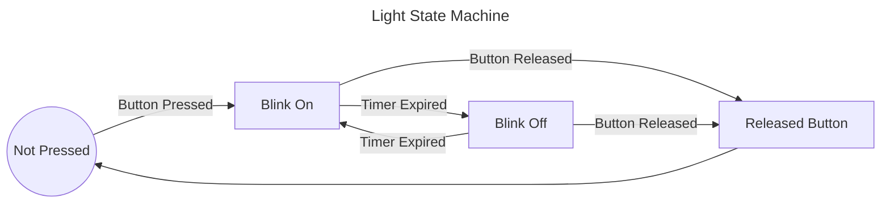

# State Machines

## What is a state machine

- **Time** series sequence of operations
    - Flashing light On and Off with time passing between changes
- **Other work** happens between steps
    - Timers, display update, other work
- **Waiting for** something else to finish before proceeding

## Requirements

- **Some value** that keeps track of current position in operation
- **Transition Logic** to move from one logical state to another
- **Other values** relevant to the current state

# Example

## Blinking light

When a button is pressed, blink a light until the button is released.

Requirements: 
1. When button is not pressed light will be off.
2. When button is pressed, light will blink.
    - Light will turn on immediately when button is pressed.
    - Light will continue to flash until button is released.
5. When button is released, light will turn off immediately.



## Actions to do in each state
- Not Pressed
    - if button pressed, transition to **Blink On**
- Blink On
    - Enter: Turn light on and reset timer
    - if button released, transition to **Released Button**
    - if timer expired, transition to **Blink Off**
- Blink Off
    - Enter: Turn light off and reset timer
    - if button released, transition to **Released Button**
    - if timer expired, transition to **Blink On**
- Released Button
    - Enter: Turn off light and immediately transition to Not Pressed

## Alternate Synchronous Requirements
1. Turn off light
1. Wait for button to be pressed.
2. Repeat below until button is released.
    - Turn on, wait for timer
    - Turn off, wait for timer
3. Go to top

# Unscientific Claims

## 90% of software engineering complexity is about managing State Machines

> 10% computation, 90% state maintenance

## State machines are REALLY challenging to cognitively understand and validate

- Mental gymnastics to construct the state machine in your head
- Non-linear - Disconnected transition logic
- Mental task switching

## 98% of state machines are not managed by a SM class

State variables globed together with member variables or represented by member variables

```c++
private:
Thing *m_thing = 0;
int created_id = -1;

void frame() {
  if(m_thing == 0) {
    m_thing = getThing();
  }
}
```

# Frame based execution

## Single thread of control

## Multiplexing other work on single processor

## One Task

Nothing else to do, poll internally.

```c++
/// Busy-waits on the two options.  Returns RELEASED if button released, ITimer if ITimer expired
FlashResult button_released_or_timer_expired(IIO &io, ITimer &timer)
{
    while (true)
    {
        if (io.button_released())
        {
            return FlashResult::Released;
        }
        if (timer.expired())
        {
            return FlashResult::Timer;
        }
    }
}

void flash_until_button_released(IIO &io, ITimer &timer)
{
    // Setup our initial state of the light being on and the timer being reset
    // Keep track of whether the light is on or off
    OnOff light_state = OnOff::On;
    // Turn the light on
    io.set_light(light_state);
    // Reset the timer so we get a full blink
    timer.reset(1.0);

    // Loop until the button is released or the timer expires
    // Keep looping if the thing that happened was the timer expiring.
    while (FlashResult::Timer == button_released_or_timer_expired(io, timer))
    {
        // Inside the loop the timer expired. Reset timer, flip the light state, and set the light
        timer.reset(1.0);
        light_state = toggle(light_state);
        io.set_light(light_state);
    }

    // Before we exit, turn the light back off.
    io.set_light(OnOff::Off);
}

void wait_until_button_pressed(IIO &io)
{
    while (true)
    {
        if (io.button_pressed())
        {
            break;
        }
    }
}

void start(IIO &io, ITimer &timer)
{
    io.set_light(OnOff::Off);
    while (true)
    {
        wait_until_button_pressed(io);
        flash_until_button_released(io, timer);
    }
}
```

# Realities of cooperative multitasking

Multiple things need to happen on a single processor

## Event loop
- **Fixed frame** - Loops at a fixed frequency (60hz, 100hz)
- **Event loop** - GUI like.  Often paired with medium frequency timer event

```c++
void executive() {
    button_flash.do_work();
    update_display.do_work();
    read_io.do_work();
    /// ....
}
```

## Challenges

"Component" requirements

- Maintain state that represents intermediate operations
- Logically reconstruct "next step operation" do_work function call
- Perform incremental operation and store intermediate results in state before returning

### Developer Cognitive Load


Mental representation of state.  Execution Prediction.

```basic
10 FOR i = 1 TO 10
20 PRINT "Two times"; i; "is"; 2 * i
30 NEXT i
```

- Line 10: new state of variable i is "pushed" on to our mental stack
- Nesting level that repeats with a mutable state
- Operations on changing state
- Exit criteria

### Stateful frame based version of looping program

Each time ```RUN``` is called, perform the next print.

```basic
10 REM Initialize global variables
20 IF i = 0 THEN i = 1
30 IF result = 0 THEN result = 1

40 REM Calculate the value
50 result = 2 * i

60 REM Print the value if i is less than or equal to 10
70 IF i <= 10 THEN PRINT "Two times"; i; "is"; result

80 REM Check for completion
90 IF i = 10 THEN END

100 REM Increment the counter
110 i = i + 1
120 END
```

# Stateful version of button flasher

```c++
class PolledButtonBehavior
{
public:
    enum class States
    {
        NotPressed,
        BlinkOn,
        BlinkOff,
        ReleasedButton
    };
    PolledButtonBehavior(IIO &io, ITimer &timer) : io(io), timer(timer) {}
    void do_work()
    {
        // handle_state might perform multiple state transitions, so call
        // it repeatedly until it's done working.
        while (handle_state() == true)
        {
        }
    }

    // Return false when there is no more work to do
    bool handle_state()
    {
        switch (current_state)
        {
        case States::NotPressed:
            if (io.button_pressed())
            {
                current_state = States::BlinkOn;
                io.set_light(OnOff::On);
                timer.reset(1.0);
                return true;
            }
            break;
        case States::BlinkOn:
            if (io.button_released())
            {
                current_state = States::ReleasedButton;
                return true;
            }
            if (timer.expired())
            {
                io.set_light(OnOff::Off);
                timer.reset(1.0);
                current_state = States::BlinkOff;
                return true;
            }
            break;
        case States::BlinkOff:
            if (io.button_released())
            {
                current_state = States::ReleasedButton;
                return true;
            }
            if (timer.expired())
            {
                io.set_light(OnOff::On);
                timer.reset(1.0);
                current_state = States::BlinkOn;
                return true;
            }
            break;
        case States::ReleasedButton:
            io.set_light(OnOff::Off);
            current_state = States::NotPressed;
            return true;
            break;
        }
        return false;
    }

    States get_state() const
    {
        return current_state;
    }
protected:
    States current_state = States::NotPressed;
    IIO &io;
    ITimer &timer;
};
```