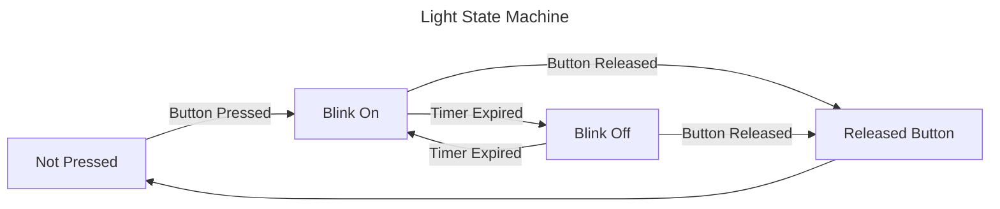

# State Machines

## What is a state machine

- **Time** series sequence of operations
- **Other work** happens between steps
- **Waiting for** something else to finish before proceeding

## Requirements

- **Some value** that keeps track of current position in operation
- **Transition Logic** to move from one logical state to another
- **Other values** relevant to the current state

# Example

## Blinking light

Requirements: 
1. When button is not pressed light will be off.
2. When button is pressed, light will blink.
3. Light will turn on immediately when button is presed.
4. Light will continue to flash until button is released.
5. When button is released, light will turn off immediately.

## Actions to do in each state
- Not Pressed
    - Poll: if button pressed, transition to **Blink On**
- Blink On
    - Enter: Turn light on and reset timer
    - Poll: if button released, transition to **Released Button**
    - Poll: if timer expired, transition to **Blink Off**
- Blink Off
    - Enter: Turn light on and reset timer
    - Poll: if button released, transition to **Released Button**
    - Poll: if timer expired, transition to **Blink On**
- Released Button
    - Enter: Turn off light and immediately transition to Not Pressed

90% of software engineering is about managing State Machines